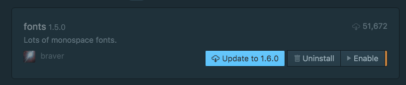
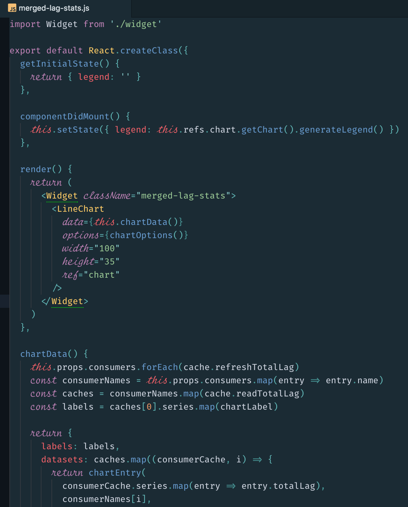
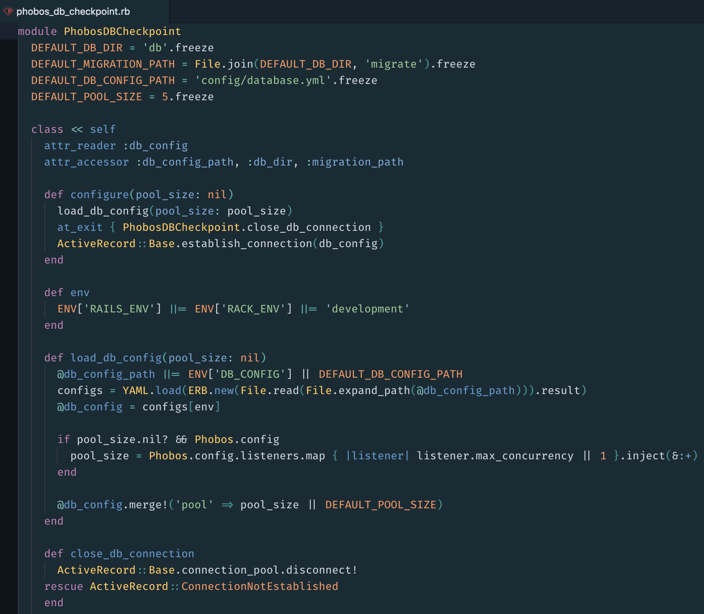
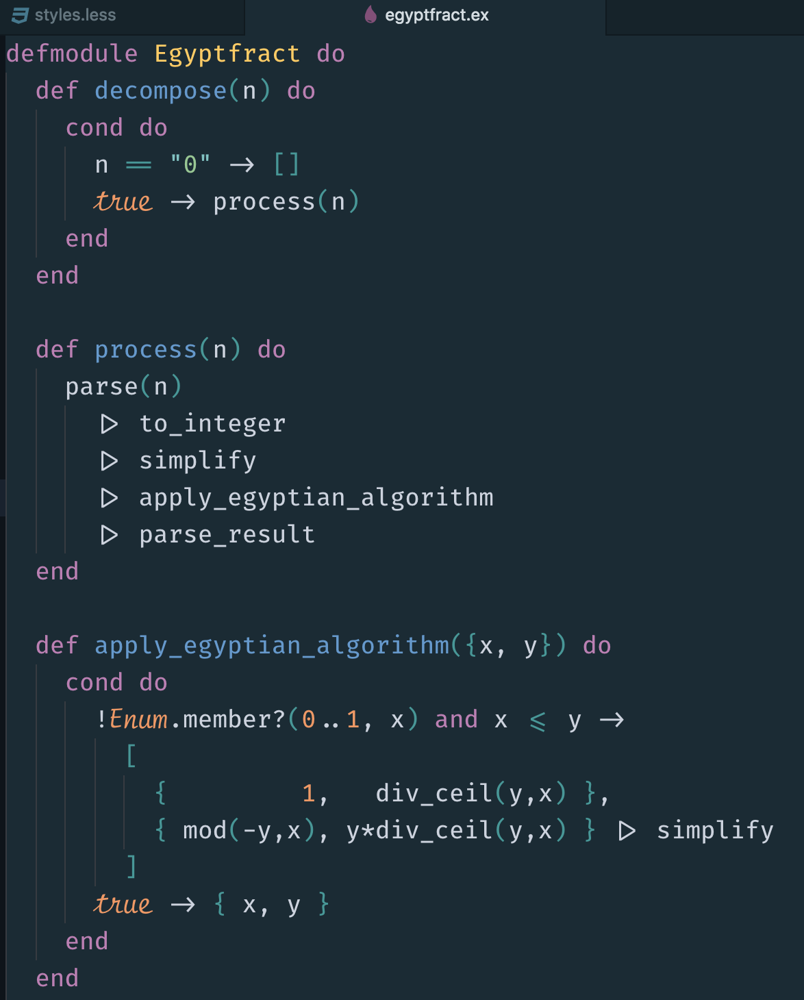
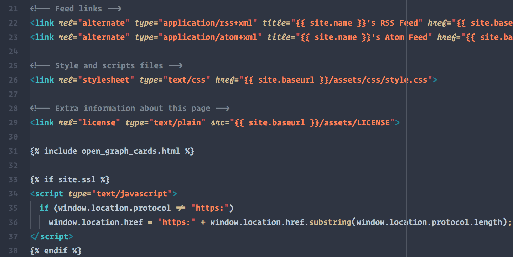
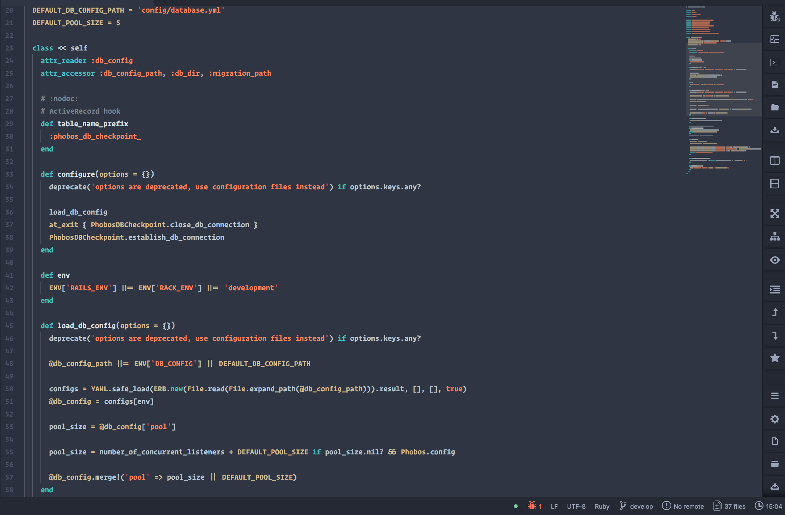

# Operator Mono for Atom Editor
Free [Operator Mono](http://www.typography.com/blog/introducing-operator) clone for Atom

A stylish way to code!

Check out the [screenshots](#screenshots).

## Installation

1. [Install fonts](#install-fonts)
2. [Configure Atom](#configure-atom)
3. [Troubleshooting](#troubleshooting)
4. [Screenshots](#screenshots)
  1. [JSX](#screenshot-jsx)
  2. [Ruby](#screenshot-ruby)
  3. [Elixir](#screenshot-elixir)
  4. [Python](#screenshot-python)

### <a name="install-fonts"></a> Install fonts

Download and install [Fira Code](https://github.com/tonsky/FiraCode) font into your system. [Installation instructions](https://github.com/tonsky/FiraCode/wiki)

Download and install [Script12 BT](https://www.myfontsfree.com/134618/script12pitchbt.htm) font into your system in the same manner. I put in repo as well


### <a name="configure-atom"></a> Configure Atom

#### Enable Ligatures

To use Fira Code properly you need to enable ligatures. There are two ways to do this, see below:

##### Ligatures - Quick install

Bring up Atom and go to Settings > Themes. Search for [Operator Mono](https://atom.io/themes/operator-mono) and install.

This syntax theme has been built to support this Fira Code, it is built from scratch using the Oceanic Next Italic palette and it will enable ligatures, and make certain attributes italic. It will also be your theme.

##### Ligatures - Manual install

If you prefer to use your own syntax theme, you have to edit your styles.less and insert these lines:

```
atom-text-editor {
  text-rendering: optimizeLegibility;

  &.editor .syntax--string.syntax--quoted,
  &.editor .syntax--string.syntax--regexp {
    -webkit-font-feature-settings: "liga" off, "calt" off;
  }
}
```

#### Enable "Operator Mono" font

In order to enable the alternative font for italic, which is probably what you came for, you have to manually edit your styles.less file and merge the code snippet found in `styles.less` in this repository with your own.

If you have any personal preferences, such as applying "Operator Mono" for comments as well, just add `.syntax--comment` in the css selector list.

### <a name="troubleshooting"></a> Troubleshooting

Atom version

The instructions / code works for the latest versions of Atom (1.20.x) and Atom Beta (1.21.x). Please make sure your editor is updated.

Are your ligatures not being applied correctly?

1. In Editor Settings, you might need to enter "Fira Code" in "Font Family"
2. Hunt down and disable interfering packages that modifies fonts, such as "fonts"



### <a name="screenshots"></a> Screenshots

The screenshots below are taken with the [Operator Mono](https://github.com/klippx/operator-mono) theme.

#### <a name="screenshot-jsx"></a> JSX



#### <a name="screenshot-ruby"></a> Ruby



#### <a name="screenshot-elixir"></a> Elixir




For enabling Italic font like SC do this :

Atom > Edit > Stylesheet > and add those codes in style.less to that.

I put my `style.less` here to make it easier.

```less
/*
 * Your Stylesheet
 *
 * This stylesheet is loaded when Atom starts up and is reloaded automatically
 * when it is changed and saved.
 *
 * Add your own CSS or Less to fully customize Atom.
 * If you are unfamiliar with Less, you can read more about it here:
 * http://lesscss.org
 */


/*
 * Examples
 * (To see them, uncomment and save)
 */

// style the background color of the tree view
.tree-view {
  // background-color: whitesmoke;
}

atom-workspace {
  font-size: 11px;
}

// style the background and foreground colors on the atom-text-editor-element itself
atom-text-editor {
  // color: white;
  // background-color: hsl(180, 24%, 12%);
}

// style UI elements inside atom-text-editor
atom-text-editor .cursor {
  // border-color: red;
}

atom-panel.tool-panel {
  font-size: 0.88em;
}

atom-text-editor.editor {
  .syntax--entity.syntax--other.syntax--attribute-name {
    //font-family: "Operator Mono";
    //font-size: 18px;
    font-style: italic;
  }
  .variable.parameter, .entity.other.inherited-class, .storage.type, .entity.other.attribute-name.pseudo-class.css{
    font-style: italic;
  }
}

atom-text-editor {
  text-rendering: optimizeLegibility;
  -webkit-font-smoothing: antialiased;
  font-family: "Operator Mono";
  font-weight: 500;
  line-height: 1.7;
}

atom-text-editor.editor {
  .syntax--storage.syntax--type.syntax--function.syntax--arrow,
  .syntax--keyword.syntax--operator:not(.accessor),
  .syntax--punctuation.syntax--definition {
    font-family: "Fira Code";
  }
  .syntax--string.syntax--quoted,
  .syntax--string.syntax--regexp {
    -webkit-font-feature-settings: "liga" off, "calt" off;
  }
}
```

This style make this look :

HTML

 


Ruby




## Authors

Amir Mohammad Safari Livari

Help of Friends in GitHub (Thanks)

